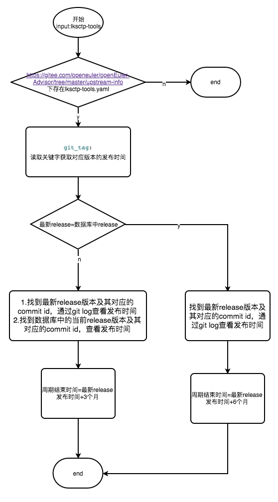

# 特性描述

- SR-PKG-MANAGE02-AR01: 包静态信息建档管理
- SR-PKG-MANAGE02-AR02: 包动态信息跟踪（生命周期）
- SR-PKG-MANAGE01-AR11: 包补丁分类管理
- SR-PKG-MANAGE03-AR01: 特性与包关联模块
- 支持网页前端显示
- 支持软件责任人及软件维护级别的存储和更改

# 依赖组件

- git, svn, pypi
- openEuler-Advisor/ upstream-info

# License
Mulan V2

# 流程分析

## 外部接口清单

| 序号 | 接口名称 | 类型 | 说明 | 入参 | 出参 | 特性号 |
|    - |   - |    - |   - |  - | - | -  |
| 1 | /packages | GET | 支持查看所有软件包静态信息、对应特性、动态信息及issue数量统计信息 | dbName | *packages-info* |   all  |
| 2 | /packages/packageInfo | GET | 支持查看指定软件包详细静态信息 | dbName, srcName |  *packages-info-detailed*  |  MANAGE02-AR01  |
| 3 | /packages/lifeCycle | PUT | 支持更新指定软件包信息字段 | dbName, srcName, [end-of-life], [maintainer], [maintainlevel] |  null  |  MANAGE02-AR02  |
| 4 | /packages/issueTrace | GET | 支持查看指定软件包issue详细信息 | dbName, srcName |  *packages-issue*  |  MANAGE01-AR11  |
| 5 | /packages/issueTrace/patched | GET | 支持下载指定软件包指定issue的补丁包 | dbName, srcName, issueId |  *packages-issue-patched*  |  MANAGE01-AR11  |

### 外部接口请求、回显格式

*需和前台对齐回显格式

- *packages-info*: 

  静态信息：name, version, release, url, rpm_license, feature, maintainer, maintainlevel;

  动态信息&动态信息统计：name, version,release, published time, end time, maintainer status, latest version, latest publish time

  动态信息统计：name, version,release, 需求， cve&安全问题， 缺陷
- *packages-info-detailed*: name, version, release, url, rpm_license, maintainer, maintainlevel, summary, description, required, subpack， subpack-provides, subpack-requires-component, subpack-requires-binary(if exist)
- *packages-issue*: list: issudId, issue-url, issue-content, issue-status, issue-download

# 功能设计
## 主体流程分析
计算生命周期结束日期：

## 数据表设计

针对不同的版本，设计多个字段相同，表名不同的table （注：表名应于对应依赖数据库名称相同）：
- Mainline

| 序号 | 名称 | 说明 | 类型 | 键 | 允许空 | 默认值 |
|    - |   - |    - |   - |  - | - | -  |
| 1 | id | 条目序号 | Int | Primary | NO | -  |
| 2 | name | 源码包名 | String | NO | YES | -  |
| 3 | url | URL | String | NO | YES | -  |
| 4 | rpm_license | license | String | NO | YES | -  |
| 5 | version | 版本号 | String | NO | YES | -  |
| 6 | release | release号 | String | NO | YES | -  |
| 7 | version_time | 当前版本发布时间 | String | NO | YES | -  |
| 8 | end_time | 结束当前版本生命周期的时间 | String | NO | YES | -  |
| 9 | maintainer_status | 生命周期状态 | String | NO | YES | "Available"  |
| 10 | latest_version | 最新版本号 | String | NO | YES | -  |
| 11 | latest_version_time | 最新版本发布时间 | String | NO | YES | -  |
| 12 | demand | 需求 | Int | NO | NO | 0  |
| 13 | cve | cve及安全漏洞 | Int | NO | NO | 0  |
| 14 | defect | 缺陷 | Int | NO | NO | 0  |
| 15 | maintainer | 维护人 | String | NO | YES | -  |
| 16 | maintainlevel | 维护级别 | Int| NO | YES | -  |
| 17 | feature | 对应特性 | String | NO | YES | -  |
| 18 | version_control | 版本控制（git，svn） | String | NO | YES | -  |
| 19 | src_repo | 上游社区repo源 | String | NO | YES | -  |
| 20 | tag_prefix | 版本标签 | String | NO | YES | -  |

回显简单事例：

生命周期终止时间定义：

1. 若最新版本和当前版本一致，生命周期终止时间为最新发布日期的6个月后；
2. 若最新版本高于当前版本，生命周期终止时间为最新发布日期的3个月后。

